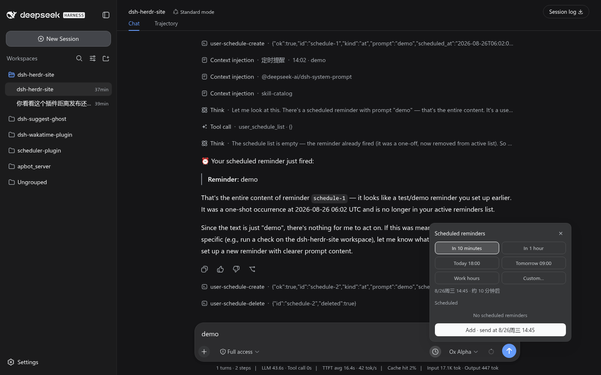

<div align="center">


# dsh-session-scheduler — In-Session Scheduled Message Plugin

[中文](./README.md) | **English**

</div>

> Built on top of the [`@deepseek-ai/dsh-schedule`](https://www.npmjs.com/package/@deepseek-ai/dsh-schedule) engine, this plugin adds a **user-facing GUI + user tools** that deliver **in-session scheduled reminders which fire on time even after you close the browser**.

DSH's existing scheduling capabilities each miss a piece: `dsh-schedule` is exposed only to the model — users cannot operate it directly; `dsh-sleep-send` stores state in localStorage and dies when the page closes; Host Automations always create *new* sessions. This plugin fills the gap: **set by the user yourself, delivered into the current conversation, driven server-side, and available across devices**.

---

## Features

- **User tools** (P0): `user_schedule_create` / `user_schedule_list` / `user_schedule_delete` / `user_schedule_edit` (edits content while preserving the original time), reusing dsh-schedule domain functions and writing session event logs that are **fully compatible** with it.
- **GUI panel**: an ⏰ button to the right of the input box (order 50) → smart time slots / custom time / send preview / list of scheduled tasks / countdown chip (with cancel-all).
- **Dock above the input box**: pending reminder bars (single item rendered directly / multiple items collapsed and expandable), each one **individually cancellable and inline-editable via ✎**.
- **`/later` delayed send**: when due, the content is sent on your behalf as if you typed it (see the mental model for the product tradeoff).
- **Arrival toast**: when a reminder is injected, a light toast pops up in the top-right corner (projection diff detection, auto-dismisses after 5 s).
- **Fires even with the page closed**: tasks persist in the session JSONL (event sourcing); when due, the dsh-schedule engine dispatches and injects a user-role message via `followup()` — no browser required.
- **Injection guard**: reminder content on non-`/later` paths is conveyed as "untrusted reminder content" through `renderReminderFraming` with JSON escaping, never treated as fresh user instructions.
- **Fork isolation**: child sessions do not inherit the parent session's reminders.
- **Follows the DSH UI language**: client microcopy is wired into the host `locale` service (`useSchedT`, a `useSyncExternalStore` subscription) — switching 中文/English in Settings flips the plugin's button, panel, dock and time wording **live**, no reload; falls back to Chinese when the host has no locale service.
- **Developer experience**: `npm run watch` watches `src/` for automatic rebuilds plus shape-regression tests (`lib/` is hard-linked into the profile automatically).
- **Testable**: 60 unit/integration tests covering pure logic, registration shape (regression guardrails), and end-to-end lifecycle.

---

## Screenshots

**⏰ Scheduling panel** — quick slots / custom time / pending list:



**Pending dock** — countdown bar above the input (✎ inline edit / ✕ cancel; the input sits right below):


**A real due-time firing** — a `⏰ Reminder due` notice lands in the conversation when the time comes (fires even with the page closed):


**Animated demos**:

| Creating a reminder (type → panel → add → dock) | Firing (countdown → injected into chat) |
|---|---|
|  |  |

---

## Mental model (read this first — avoid the "scheduled vs. delayed send" trap)

| Action | Timing | Who "speaks" | GUI presentation | Notes |
|---|---|---|---|---|
| Press Enter in the input box | Immediate | You | Normal user bubble | Right now it really is you |
| ⏰ panel / `/schedule <time> <content>` | At due time | Scheduled reminder | `Context injection · Scheduled reminder · HH:MM · content` (collapsible notice line) | **Reminder**: new content injected when due; not what you typed |
| `/later <time> <content>` | At due time | As you | Normal user bubble | **Delayed send**: when due, the content is delivered as `kind:'user'` on your behalf (no injection-guard framing — deliberate product tradeoff, see below) |
| `every` (recurring, ≥300 s) | Recurring | Scheduled reminder | Same as `/schedule` | Created only via tools/panel |

> **Why `/schedule` is not the "delayed send" you might expect**: the `/schedule …` line in the input box is sent **immediately** upon Enter and logged as a user message; what gets postponed is the **newly generated reminder content** (arriving as a context injection). If what you want is "take the sentence I'm typing right now and say it later as me", use **`/later`** instead.

> **The deliberate `/later` tradeoff**: it lets content that was not actually typed by a human in real time appear as a user bubble, bypassing the core trust boundary between "injection" and "human-typed". Therefore it is kept only on the path where a human **explicitly types** `/later`; the panel and tools always go through the safe context-injection path.

```
┌─ Immediate ──────────┐  ┌─ Scheduled reminder (/schedule, ⏰ panel) ──┐  ┌─ Delayed send (/later) ──┐
│ Enter to send        │  │ Injected when due · context-injection       │  │ Sent as "me" when due    │
│ Normal user bubble   │  │ notice line, guarded framing (non-trust)    │  │ Normal user bubble       │
└──────────────────────┘  └─────────────────────────────────────────────┘  └──────────────────────────┘
```

---

## Installation

```sh
# inside this directory (dsh-session-scheduler/)
npm install

# build host + client:
npm run build
# → lib/index.js (host, tsc) + lib/client.js (browser, esbuild)

# tests:
npm test
```

Install into a DSH Web environment (a host such as `--profile web`):

```sh
dsh plugin --profile web add "file:/path/to/dsh-session-scheduler"
# takes effect after restarting dsh web (dsh web)
```

`cordis.patch.yml` automatically inserts the host-plugin lines into the loader tree; the `package.json#dsh.client` declaration brings the browser side into the boot graph.

## Configuration

Works out of the box by default. Override by id in `~/.dsh/profiles/web/cordis.patch.yml`:

```yaml
- id: session-scheduler
  config:
    maxSchedules: 100   # per-session cap on user tasks
```

> v1 smart time slots use built-in defaults (work hours 09:00–18:00, lunch break 12:00–14:00, evening 18:00–22:00, night quiet hours). "Configurable smart time slots" is on the v1.1 roadmap.

## Architecture

```
DSH Host
├── dsh-schedule            ← underlying engine: event sourcing / dispatch / followup (peer dependency, loads first)
│       │
│       ▼
└── dsh-session-scheduler   ← this plugin (user interface layer)
    ├── user tools user_schedule_*        → writes schedule/change (fully compatible)
    │                                      + companion ownership events (marking user origin)
    ├── slash commands (client→host change channel) → reuse the same user-tools logic
    └── session projection userSchedules  → GUI reads the task list in real time
            │
            ▼ (WebSocket / HTTP)
DSH Web Client
└── conversation.input.right slot (order 50)
    ├── SchedButton   ⏰ opens the panel
    ├── SchedPanel    smart slots / custom time / preview / task list
    └── CountdownChip next due time (count) [✕] cancel all
```

Data flow:

```
User confirms in the panel
  └─(/user-schedule:create {json})  → host handler
        ├─ schedule/change {create}      (decodable by dsh-schedule, no interference)
        └─ session-scheduler/user-schedule {add} (owned by this plugin)
  → session event log (JSONL, persisted server-side)
  → when due: dsh-schedule runMaintenance → followup() injects a user-role message
  → userSchedules projection push → GUI chip/list updates
```

## Key design decisions

### 1. How the `source` field avoids breaking dsh-schedule (PRD adaptation)

The PRD wanted a `source: 'user-tool'` field inside the `schedule/change` payload to distinguish creation origin. But dsh-schedule applies **strict decoding** to `schedule/change` (`hasExactKeys` rejects any extra fields) — adding one `source` key would make dsh-schedule's own fold throw `corrupt_schedule_log`, breaking "both installed side by side without interference" (AC-20).

**This plugin's solution**: the `schedule/change` payload stays untouched (fully compatible); additionally the plugin writes its own companion event `session-scheduler/user-schedule` (`{version:1, operation:'add'|'remove', id}`) recording user origin. dsh-schedule's fold skips events other than `schedule/change`, so the two coexist naturally; the GUI and `user_schedule_list` present user tasks based on "active schedule/change records ∩ companion ownership".

### 1b. Load-time compatibility for owned event types: register at activation (owned-event-registration.ts)

dsh-session's persistence read path validates every event type while loading history: an event whose type is neither in the core whitelist `KNOWN_SESSION_EVENT_TYPES` nor flagged `ignorable:true` on its envelope causes the **entire log to be rejected** (`SessionFormatUnsupportedError`, surfacing in the GUI as "failed to load history") — and the companion event (§1) is exactly such plugin-owned vocabulary. The current build's `Session.append(type, data)` does not expose an `ignorable` flag and core docs explicitly state the plugin registration surface is deferred, so this plugin calls `registerOwnedSessionEventType()` first thing in `apply()` to register its owned type into the host's set (process-level and idempotent; that module is host-side only — the client bundle must never import it).

> TODO(upstream): once dsh-session exposes the append-side `ignorable` flag, switch to marking at write time (truer to the envelope contract) and remove runtime registration.

### 2. Client↔host change channel: slash commands

In rc.7 there is no generic "invoke host function" channel from client to arbitrary plugins (Typert Remote requires generator + host-service orchestration — over-coupling). This plugin uses DSH's first-class citizen, the **slash command**: the client issues `session.command('/user-schedule-create {json}')` straight to a host handler (the handler carries `agent`, enabling `agent.session.append` + `ctx.sessions.flush`), and `command/run`/`command/done` land in the log automatically (audit-friendly). The command sets `recordInput: false` to avoid double-writing GUI payloads into the log (the authoritative payload lives in domain events).

> ⚠️ Command names must match `^[a-z][a-z0-9_-]*$` (no colons) — hard-won lesson: `user-schedule:create` fails `parseCommand`/`COMMAND_NAME`, making the command silently never execute (caught by live E2E).

For reading state, the plugin uses a **session projection** `userSchedules` (`useProjection`): the host incrementally folds as events commit and pushes in real time — same mechanism as `dsh-suggest-ghost`.

### 3. Fork isolation (AC-07)

dsh-schedule uses `seedLength` to exclude derived sessions from inheriting the prefix; the projection framework itself folds the whole log. This plugin's projection **resets its own state** upon encountering a `session/end-seed` event, so child sessions never inherit the parent's user reminders.

### 4. Delivery mechanism: does not drive the input box (AC-06 tradeoff)

The PRD / dsh-sleep-send had "draft changed before sending → auto-cancel" logic. By design, this plugin uses `followup()` injection instead (reminder content is frozen at creation time); later draft edits will **not** silently cancel an explicitly scheduled reminder — otherwise it would conflict with "fires on time even with the page closed" (AC-04/AC-05, this plugin's core value). Cancellation is provided by the chip's "cancel all" / the list's "delete single". This is a deliberate product tradeoff; v1.1 could add back an opt-in "bind to draft version" switch.

### 5. A dedicated scheduler for user reminders

dsh-schedule's runtime only re-drives on three occasions: agent creation, persisted changes made by **its own tools**, and agent going idle. Reminders created via this plugin's commands/tools hit none of those, so no timer gets armed and nothing ever fires (reproduced live in E2E: task visible but never due). Hence this plugin ships its own per-agent scheduler (`runtime.ts`): re-drive on user create/delete, self-heal re-drive on idle, and dispatch when due following dsh-schedule semantics (dispatch + followup), deduplicating against dsh-schedule via **the same persisted log** (single fire — verified by integration tests and live E2E).

### 6. The `ProjectionDefinition` version trap (root cause of the invisible dock — fixed)

Between **rc.1 → rc.2**, `@deepseek-ai/dsh-session-projection` changed the registration contract from `{schema, view}` to `{stateSchema, wire:{viewSchema, view}}`. The host (web profile) runs rc.2 while the plugin's dev dependency resolved to rc.1 for a while: at the type level the old contract "passed", but at runtime the new contract treated units lacking `wire` as host-only and skipped them → client `useProjection('userSchedules')` stayed `undefined` forever, and the dock silently vanished. The name cast `as never` left TS powerless to catch any of it.

**Lessons and guardrails**:
1. `domain.ts` extends both `SessionProjectionMap` and `SessionProjectionStateMap`; projection units are written in the rc.2 shape (`stateSchema` + `wire`).
2. `package.json` pins `@deepseek-ai/dsh-session-projection` to `^0.1.1-rc.2` (peer + dev).
3. `tests/projection-unit.test.mjs` locks the shape **at runtime** (old shapes are judged NOT client-visible), independent of whether the registry can install rc.2 types.

## Verification status

- **Unit/integration tests**: all 60 green (host + client builds pass; `npm run typecheck` reports pre-existing dependency type noise from duplicate `@deepseek-ai/dsh-session` copies in the dev environment — the build is unaffected, see "dependency alignment" above)
- **Live E2E on an isolated instance (Playwright headless driving the real UI)**: button renders → open panel → custom time → confirm → chip appears → task list visible → **actually fires when due (≈75 s planned, 72 s measured) → conversation shows `user/message` (source=plugin:session-scheduler)**; the on-disk log was checked entry by entry: create→owned→dispatch→followup all persisted, no duplicate firing.
- **Kernel generation compatibility (measured 2026-09-07)**: both `0.1.1-rc.2` and `0.1.2-rc.1` pass host entry linking (17/17 runtime symbols present), a real headless boot (stops at `MISSING_CREDENTIAL`, which is after plugins load) and a real web boot (`lib/client.js` HTTP 200). Two choices make one codebase span both: the settings namespace is written as `'dsh-session-scheduler' as SettingsNamespace` (the `settingsNamespace()` helper was removed in `0.1.2`, where importing it at runtime makes the whole module fail to link), and the `SettingsScope` the settings card needs is declared locally in `src/client/components/SchedulerSettingsCard.tsx` rather than imported from `@deepseek-ai/dsh-client-runtime/client` — that package is `0.1.1`-only and was split out in `0.1.2`, and the identically named `SettingsScope` on the host side (`dsh-settings`) has different members from the client side. Peer deps are an explicit generation list `^0.1.1-rc.2 || ^0.1.2-rc.1` (node-semver excludes prereleases from every range unless a comparator carries the same `[major.minor.patch]` tuple, so no range form spans generations): **add another entry whenever upstream ships a new rc generation**.

## Layout

```
dsh-session-scheduler/
├── src/
│   ├── index.ts              # host entry: wires up user tools + commands + projection + scheduler
│   ├── domain.ts             # event/projection types + SessionEventMap/ProjectionMap/StateMap extensions
│   ├── user-tools.ts         # user_schedule_create/list/delete/edit + foldOwnedDelivery
│   ├── projection.ts         # userSchedules projection fold (fork isolation; stateSchema+wire contract)
│   ├── runtime.ts            # user-reminder scheduler (arms timers, dispatches + followup when due, delivery routing)
│   ├── commands.ts           # client↔host change channel (slash commands: create/list/delete/edit/schedule/later)
│   ├── smart-window.ts       # smart time-slot computation (pure function, shared host/client)
│   ├── time-utils.ts         # time formatting (pure function, shared host/client; relative/absolute wording in zh/en)
│   ├── owned-event-registration.ts  # owned event type registration (avoids history-log rejection)
│   └── client/
│       ├── index.tsx         # browser entry: input.right/dock slot registration + command channel + toast host
│       ├── styles.ts         # ss- namespaced design tokens + component styles + toast/dock edit styles
│       ├── strings.ts        # bilingual microcopy dictionaries (zh/en, identical key sets) + format placeholders
│       ├── useSchedT.ts      # hook following the host locale (useSyncExternalStore)
│       ├── toast.tsx         # arrival banner (triggered by projection diff detection)
│       └── components/       # SchedButton / SchedPanel / ScheduleDock (inline editing) / TaskList
├── tests/                    # unit + integration tests (node:test: runtime decisions, projection shape regression, delivery routing)
├── build.mjs                 # tsc(host) + client type check + esbuild(client)
├── build-client.mjs/.build-host.mjs  # per-side builds (reused by watch)
├── watch.mjs                 # watches src/, rebuilds + runs shape regression tests
├── cordis.patch.yml          # bundle patch
└── package.json
```

### The scheduler (`runtime.ts`) — why it exists

dsh-schedule's runtime only re-drives on: agent creation, persisted changes from **its own tools**, and agent going idle. User reminders created through this plugin's commands/tools match none of those occasions, leaving timers unarmed and nothing firing (reproduced in live E2E). So the plugin ships a per-agent user scheduler:

- `requestDrive()` after every successful user create/delete; self-healing re-drive when the agent goes idle too.
- Reuses dsh-schedule's exported domain functions (fold / `resolveEveryOccurrence` / `render*Framing`) and `agent.followup()`, dispatching with the same "fold → inject → append dispatch → flush" semantics.
- **Deduplication**: shares **the same persisted log** with dsh-schedule; `fold → append dispatch` completes synchronously on the same JS thread — whoever writes first, the other side's fold sees it as already dispatched → no double firing (holds for both one-shot and fixed-interval schedules; verified in E2E and integration tests).

## Acceptance criteria (v1.0.0)

| ID | Scenario | Status |
|---|---|---|
| AC-01 | Type content, click ⏰ | ✅ verified in live E2E: button renders, panel opens |
| AC-02 | Smart slot confirmation | ✅ verified in live E2E: custom time → confirm → chip shows count / task list |
| AC-03 | Past times rejected | Panel validation + host-side `not_future` fallback |
| AC-04 | Message injected when due | ✅ verified in live E2E: after due time (≈75 s planned) conversation shows user/message (source=plugin) |
| AC-05 | Survives page close/reopen | Event-log persistence + cold restore via the `userSchedules` projection |
| AC-06 | Draft changed | Deliberate tradeoff: no silent cancellation (see above) |
| AC-07 | Fork does not inherit | Reset on `session/end-seed` |
| AC-08 | 100 concurrent creates | Agent transaction serialization + per-session cap of 100 |
| AC-20 | Coexists with dsh-schedule | `schedule/change` payload unchanged (strict compatibility) |

## References

- PRD & design docs: `prd.md` and `docs/` in the project root (workspace-level, outside this package)
- dsh-schedule source analysis: `../references/dsh-schedule-analysis.md`
- dsh-sleep-send source analysis: `../references/dsh-sleep-send-analysis.md`

## License

MIT
