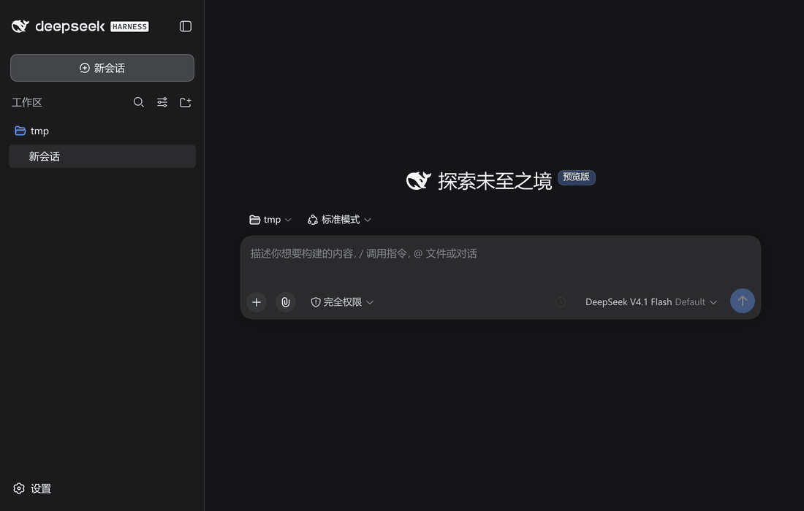

<div align="center">


# dsh-later — In-Session Scheduled Message Plugin

[中文](./README.md) | **English**

</div>

> Set reminders for yourself inside DSH: **set by you, delivered into the current conversation, driven server-side, available across devices** — on time, even with the browser closed.

**`/later` delayed send** — no panel needed: type one line in the input box and it is sent later as yourself (demo: typing `/later +5s`, `+3m`, `+1h20m` character by character, then Enter to start the countdowns; the `+5s` one really lands when due):

<p align="center">

</p>

---

## How to use

### Schedule panel

Click the **"Schedule send"** button to the right of the input box. The panel uses the **input box content** as the reminder text; pick a time, then click **"Add · send at HH:MM"** (the button stays disabled until a time is chosen). A countdown row then appears above the input box.

| Capability | Description |
|---|---|
| Quick chips | One-tap `in 10 minutes` / `in 1 hour` / `work hours` (configurable in settings) |
| Custom time | "Custom…" opens date + time inputs |
| Send preview | See the exact due-time form before confirming |
| Task list | All scheduled items, deletable one by one |
| Cancel all | Cancel action on the chip clears every reminder in this conversation |

### Time formats

All of these are accepted (`/schedule`, `/later`, and the panel's custom time share the same parser):

| Kind | Examples |
|---|---|
| Relative duration | `+30m` · `+1h30m` · `+90s` · `+1w` · `30分钟后` · `半小时后` |
| Time today | `15:32` · `9点` · `9点半` · `1532` |
| Relative day + time | `明天9点` · `后天 10:00` |
| Date + time | `8月21日 15:32` · `2026-08-21 15:32` · `0821-1532` |

A bare time (like `1532`) rolls over to tomorrow if it has already passed today (up to 7 days). Writing `明天`/`后天` is taken literally — if that time has passed you are told to use a concrete date instead. A month/day only (like `8月21日`) rolls over to next year when this year's has passed.

### Commands

| Command | Effect |
|---|---|
| `/schedule <time> <content>` | Create a reminder (shows up in the conversation when due) |
| `/later <time> <content>` | Delayed send: deliver the content later as yourself |
| `/schedule every <interval> <content>` | Recurring reminder (interval ≥ 5 min) |

```
/schedule 明天9点 提交周报
/later 1532 提醒团队同步进度
```

The model can also call user tools on your behalf to create/inspect/delete/edit reminders (`user_schedule_create` / `user_schedule_list` / `user_schedule_delete` / `user_schedule_edit`).

### Pending dock

The countdown rows above the input box. Each row ends with three buttons: **Edit reminder** (change the text inline), **Delete reminder** (cancel that item), and **Send now** (push it to the agent immediately, skipping the countdown).

> ⚠️ "Send now" is not a confirm button — it **immediately** delivers the reminder text to the agent and wakes the model. To cancel, use Delete.

### Sidebar presence indicator

Conversations with active reminders show a pixel clock in their sidebar row (alongside the "active" orb):

| Icon | Meaning |
|---|---|
|  | Purple · has scheduled reminders |
|  | Amber · next fire within 5 minutes |
|  | Red · overdue (waiting for the session to become idle) |

Hover shows "Next at 15:32 · 3 task(s)"; when overdue it shows "Due · 3 task(s) (sends when the session is idle)".

---

## Screenshots

**Schedule panel** — quick slots / custom time / pending list:


**Pending dock** — countdown rows above the input box (inline edit / cancel):


**A real due-time firing** — when the time comes, a `⏰ Scheduled reminder` message appears in the conversation (fires even with the page closed):


**Animated demos**:

| Creating a reminder (type → panel → add → dock) | Firing when due (countdown → message arrives) |
|---|---|
|  |  |

**`/later` shortcut** — skip the panel and type one line in the composer to send as yourself later:


---

## Feature overview

- **Input-bar timer button**: one click opens the schedule panel — smart time slots / custom time / send preview / pending list / countdown chip.
- **Pending dock**: a list above the input box; each item can be **cancelled** individually or **edited inline** via its edit icon.
- **`/later` delayed send**: deliver *the text you are typing right now* later, as yourself (see [the difference](#reminders-vs-delayed-sends-whats-the-difference)).
- **Sidebar presence indicator**: conversations with active reminders show a pixel clock in the sidebar (purple = scheduled · amber = fires within 5 min · red = overdue); hover shows count and next fire time.
- **Fires with the page closed**: reminders persist server-side and arrive on time across devices.
- **Never impersonates you**: when due, the message appears as a `Reminder` — it is never framed as your own words.
- **Multilingual**: follows the DSH UI language (Chinese / English), live without reload.
- **Reminders don't carry across sessions**: sessions forked from this one never inherit the parent's reminders.

---

## Reminders vs. delayed sends: what's the difference?

| Action | When it takes effect | Who sends it | What you see |
|---|---|---|---|
| Enter in the input box | Immediately | You | Normal user bubble |
| Schedule panel / `/schedule <time> <content>` | When due | The reminder | `Reminder · HH:MM · content` row |
| `/later <time> <content>` | When due | As yourself | Normal user bubble |

> **`/schedule` is not "delayed send"**: pressing Enter on `/schedule …` sends it *immediately* (as a user message); only the **reminder itself** is deferred. If you want "send the text I'm typing now, later, as if I said it", use **`/later`**.

---

## Quick start

### Install into DSH

**From npm (recommended — prebuilt, no approval needed):**

```sh
dsh plugin --profile web add dsh-later
# restart dsh web to activate
```

Or build from source and add it to your DSH Web profile:

```sh
cd dsh-later
npm install
npm run build

dsh plugin --profile web add "file:/path/to/dsh-later"
# restart dsh web to activate
```

> Dev tip: `npm run watch` rebuilds on `src/` changes and runs shape regression tests.

### Your first reminder

1. Open any conversation — a "Schedule" button appears right of the input box;
2. Click it → pick a smart slot, or enter a custom time and content;
3. Confirm → a countdown chip appears next to the button and the dock shows the pending item;
4. When due, a `Reminder` message lands in the conversation — it fires even if you close the page.

---

## Long-text reminders

Reminder content is limited to **1000 characters** by default. For longer content, enable `allowLongPrompts` in **DSH Settings → Plugins → Session Scheduler** and set `maxPromptChars`.

- **Good for**: code snippets, meeting notes, long quotes, cross-device notes/todos.
- **Not recommended**: text that could read as instructions (the longer it is, the bigger the risk); a shared public profile (anyone could raise the limit).

---

## Configuration

Works out of the box. Adjust in **DSH Settings → Plugins → Session Scheduler** (applies live, no restart):

| Field | Description | Default |
|---|---|---|
| Show schedule button | Whether the timer button shows on the input bar (hiding it never affects existing reminders or the dock) | Shown |
| Max schedules per session | Max reminders allowed in one conversation | 100 |
| Allow long prompts | Lift the 1000-character default cap | Off |
| Custom cap | Character cap when `allowLongPrompts` is on | 1000 |
| Work hours / lunch / night quiet | Five HH:mm fields driving smart slots and auto-scheduling | See settings page |

> Advanced: defaults can also be overridden at startup via `cordis.patch.yml` (e.g. `maxSchedules`) — see `docs/` and the schema.

---

## Technical documentation

Developer- and maintainer-oriented content has moved out of this README:

- [Architecture & data flow](./docs/architecture.md) — host/client layering, event flow, layout, scheduler rationale
- [Key design decisions](./docs/design-decisions.md) — `source` field, slash channel, fork isolation, anti-spoofing tradeoffs
- [Verification & acceptance criteria](./docs/verification.md) — tests, live E2E, cross-kernel compatibility, AC table

## References

- PRD & design docs: `prd.md` and `docs/` in the project root (workspace-level, outside this package)
- dsh-schedule source analysis: `../references/dsh-schedule-analysis.md`
- dsh-sleep-send source analysis: `../references/dsh-sleep-send-analysis.md`

## License

MIT

---

<div align="center">


</div>
