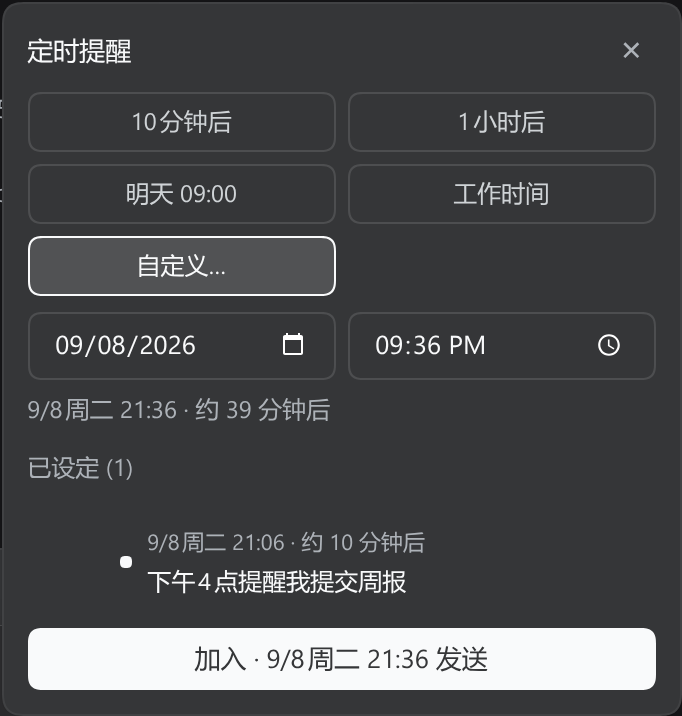
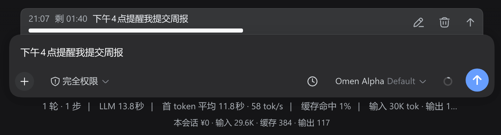
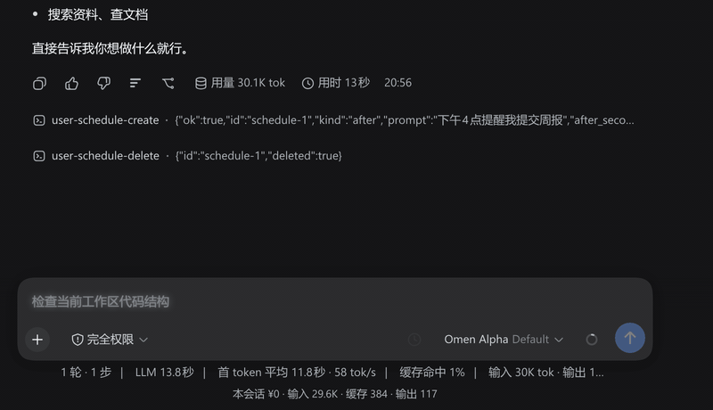
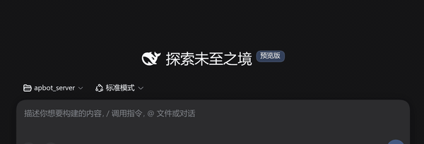

<div align="center">


# dsh-later — 会话内定时消息插件

**中文** | [English](./README.en.md)

</div>

> 在 DSH 里给自己设提醒：到点后**当前这个会话**准时收到一条消息——即使你关掉了网页。

DSH 现有定时能力各缺一角：内置定时只暴露给模型、用户无法直接操作；sleep-send 存在浏览器里、关网页即死；Host Automations 创建的是新会话。本插件补齐「**用户自己设、当前对话收到、服务端驱动、跨设备**」这一格。

---

## 特性一览

- **输入框定时按钮**：一键打开定时面板——智能时段 / 自定义时间 / 发送预览 / 已设定任务列表 / 倒计时。
- **待发送 dock**：输入框上方的提醒列表，每条可单独**取消**，或点击编辑图标**行内修改内容**。
- **`/later` 延迟发送**：把「你现在打的这句话」稍后以你的身份发出去（和定时提醒的区别见[这里](#定时提醒和延迟发送有什么区别)）。
- **侧栏状态标识**：有活动提醒的会话，侧栏显示像素时钟（紫=定时中 · 琥珀=5 分钟内 · 红=已到期），悬停可见任务数与下次时间。
- **关网页也能触发**：提醒保存在服务端，关网页、换设备都会准时到达。
- **不会冒充你本人**：到点后显示为「定时提醒」消息，而不是假装是你自己发的。
- **多语言**：跟随 DSH 界面语言（中文 / English），切换即时生效。
- **提醒不跨会话**：由当前会话派生出的子会话，不会带上父会话的提醒。

---

## 界面展示

**定时面板** —— 快捷时段 / 自定义时间 / 已设定任务列表：



**待发送 dock** —— 输入框上方倒计时条（行内编辑 / 取消；下方即输入框）：



**到期真实触发** —— 到点后对话里出现「⏰ 定时提醒」消息（关网页也照常触发）：


**动图演示**：

| 创建定时提醒（输入 → 面板 → 加入 → dock） | 到期触发（倒计时 → 收到消息） |
|---|---|
|  |  |

**`/later` 快捷命令** —— 不打面板，直接在输入框敲一行就以你的身份延迟发送：



---

## 定时提醒和延迟发送，有什么区别？

| 动作 | 什么时候生效 | 谁发出 | 你看到 |
|---|---|---|---|
| 输入框 Enter 直接发 | 立即 | 你 | 普通用户气泡 |
| 定时面板 / `/schedule <时间> <内容>` | 到点 | 定时提醒 | `定时提醒 · HH:MM · 内容` 提醒行 |
| `/later <时间> <内容>` | 到点 | 以你的身份 | 普通用户气泡 |

> **`/schedule` 不是「延迟发送」**：输入框里那行 `/schedule …` 一按回车就会**立刻**发出去（作为一条用户消息），被推迟的只是**提醒本身**。如果你想要的是「把我现在打的这句话，过会儿当作我亲口发的」，请用 **`/later`**。

---

## 快速开始

### 安装到 DSH

在插件源码目录构建后装入 DSH Web profile：

```sh
cd dsh-later
npm install
npm run build

dsh plugin --profile web add "file:/path/to/dsh-later"
# 重启 dsh web 后生效
```

> 开发提示：`npm run watch` 监听 `src/` 自动重建并跑形状回归测试，改动即时生效。

### 第一条提醒

1. 打开任意会话，输入框右侧出现「定时」按钮；
2. 点击按钮 → 选一个智能时段，或填自定义时间与内容；
3. 点确认 → 按钮旁出现倒计时芯片，输入框上方 dock 显示待发条目；
4. 到点后对话里收到「定时提醒」消息——关掉网页也会触发。

---

## 使用指南

### 定时面板

| 能力 | 说明 |
|---|---|
| 快捷芯片 | 工作时间 / 明天上午等常用时段一键填充（智能时段可在设置里改） |
| 自定义时间 | 相对（`30 分钟后`）或绝对（`今天 18:00`）均可 |
| 发送预览 | 确认前预览到点后收到的样子 |
| 任务列表 | 已设定任务，可单个删除 |
| 取消全部 | 芯片上的取消操作一键清空本会话所有提醒 |

### 命令

| 命令 | 作用 |
|---|---|
| `/schedule <时间> <内容>` | 创建一条定时提醒（到点出现在对话里） |
| `/later <时间> <内容>` | 延迟发送：到点以你的身份发出该内容 |
| `/schedule every <周期> <内容>` | 周期性提醒（周期 ≥ 5 分钟） |

模型也可以直接调用用户工具为你创建/查询/修改提醒（`user_schedule_create` / `user_schedule_list` / `user_schedule_delete` / `user_schedule_edit`）。

### 侧栏状态标识

有活动提醒的会话，行内会出现像素时钟（与「进行中」orb 并存）：

| 图标 | 含义 |
|---|---|
|  | 紫 · 有定时中提醒 |
|  | 琥珀 · 下次触发 ≤ 5 分钟 |
|  | 红 · 已到期（等待会话空闲派发） |

鼠标悬停可见「任务数 · 下次时间」。

---

## 长文本提醒

提醒内容默认上限 **1000 字符**。需要更长时，在 **DSH 设置 → 插件 → Session Scheduler** 开启 `allowLongPrompts` 并设置 `maxPromptChars`。

- **适合**：代码片段、会议纪要、长引文、跨设备日记/待办。
- **不建议**：提醒内容里包含可能被当成「指令」的话（内容越长风险越大）；多人共享同一台设备的公共 profile（任何人都能调大）。

---

## 配置

默认开箱即用。可在 **DSH 设置 → 插件 → Session Scheduler** 调整（保存即时生效，无需重启）：

| 字段 | 说明 | 默认 |
|---|---|---|
| 显示定时按钮 | 输入框右侧是否显示定时按钮（隐藏不影响已创建的提醒触发与 dock 显示） | 显示 |
| 单会话任务上限 | 一个会话内最多允许的提醒数 | 100 |
| 允许长文本 | 解除 1000 字符默认下限 | 关闭 |
| 自定义上限 | `allowLongPrompts` 开启时的字符上限 | 1000 |
| 工作时间 / 午休 / 晚间静默 | 智能时段 5 个 HH:mm 字段，决定快捷芯片与智能排期 | 见设置页 |

> 进阶：也可以用 `cordis.patch.yml` 在启动期覆盖默认值（如 `maxSchedules`），见 `docs/` 与 schema。

---

## 技术文档

以下内容面向开发者与维护者，已移出本 README：

- [架构与数据流](./docs/architecture.md) — 宿主/客户端分层、事件流、目录结构、调度器原理
- [关键设计决策](./docs/design-decisions.md) — source 字段、slash 通道、fork 隔离、注入防护等取舍
- [验证状态与验收对照](./docs/verification.md) — 测试、线上 E2E、跨内核代次兼容、AC 对照表

## 参考

- PRD 与设计文档：项目根目录 `prd.md`、`docs/`
- dsh-schedule 源码分析：`../references/dsh-schedule-analysis.md`
- dsh-sleep-send 源码分析：`../references/dsh-sleep-send-analysis.md`

## 许可

MIT

---

<div align="center">


</div>
